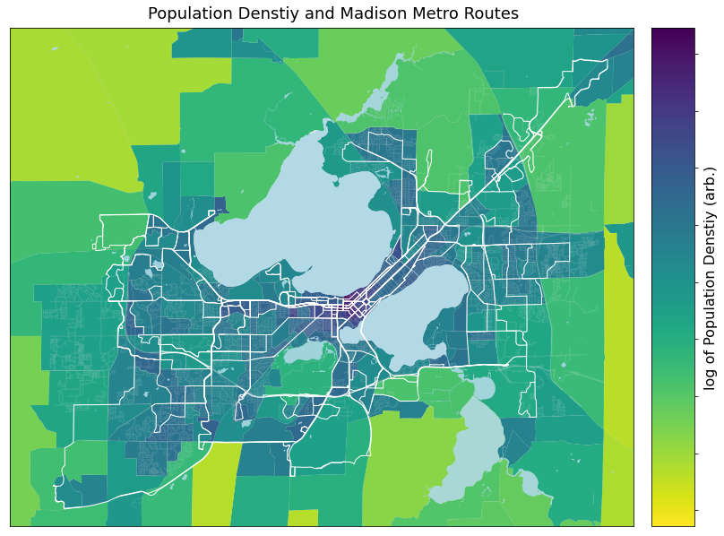
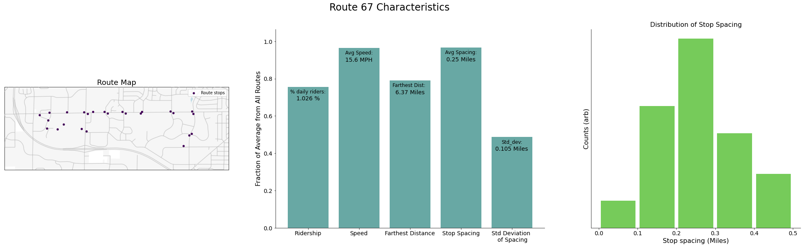
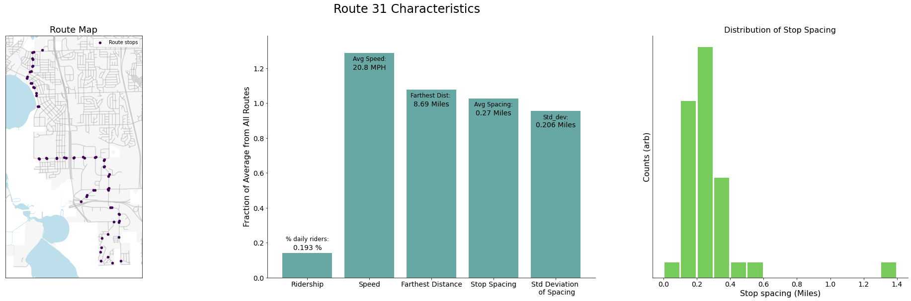
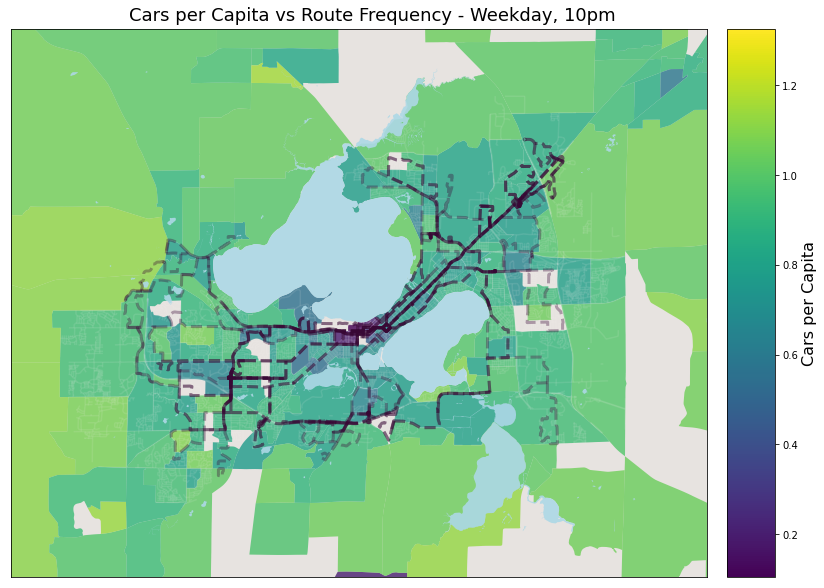
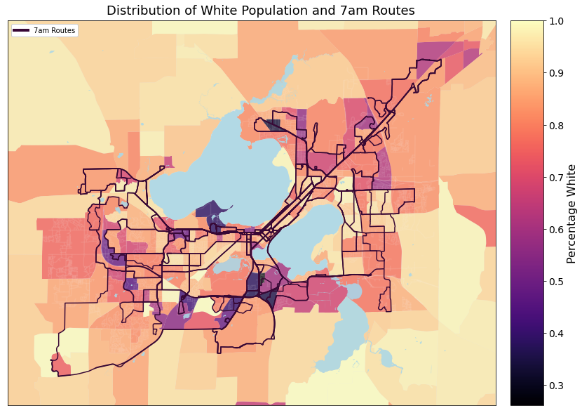

In collaberation with CaSP (Catalysts for Science Policy @ UW-Madison), we are putting together a white paper for submission. These figures were generated by Megan Tabbutt. Demographics data is provided by the American Community Survey and the 2010 US Census, collected and analyzed by Brittany Baur. A summary of the plots that were generarated for this paper can be seen below. 

# Fall 2020 work on BRT Summary

Author: Megan Tabbutt

## 1. Madison Metro Summary:

Figure 1: Population density on a log scale for the city of Madison. Value is based on survey responses/sq mile. Madison Metro bus system map is shown in white overlaid. 

 

## 2. Route Comparison:

Overall Averages of Statistics not Including Route 80:

_Ridership: 1.36%     Speed: 16.19 MPH     Trip Distance: 8.06 Mi     Spacing: 0.26 Mi     Std Dev.: 0.22 Mi_

 

Route 27 is an of a route that needs to be re-balanced: too close on part of the route, several stops are .1miles or less apart. 

 

Route 23 is an example of a very specialized route. It was created to take people from the capitol (and a couple places on E Washington Ave) to American Family Center (employment center).

 

Route 67 is an example of a well balanced route. 

 

Route 31 is an example of a limited stop zone route. It goes far, fast and has good spacing. 

 

## 3. Route Stop Spacing Summary:

Figure 2: Distribution of stop spacing by route. Three quartiles are shown: top 25%, middle 50%, bottom 25%. The overall system average is also show. Routes with a very high top 25% stop spacing most likely have a limited stop zone on the route. These limited stop zones increase route speed by having a section that does not stop at all, and typically cover larger distances across the city. 

 

## 4. Route Frequency:

Figure 3: A Summary of the frequency of service for bus routes during the weekday. Since the specific time a bus comes depends on the stop, the middle stop of each route is chosen for this figure. 

 

## 5. Demographics for Black and Hispanic Populations:

  
  

 

## 6. Demographics vs Departure time for Work:

How to read this graph: If there are 50 Black workers and 50 White workers, then at any given hour 50% of the people leaving should be Black if there is a fair distribution of work time (not depending on race). Then we ask who is actually leaving at 10pm. It turns out to be 75 Black people and 25 White people. So a Black person is 1.5 times more likely to leave for work at 10pm than a White person. And a White person is .5 times more likely to leave to work at 10pm than a Black person. This is the factor that is plotted on the y axis. Given this graph. If it is 10pm in Wisconsin, Hispanic people are 1.25 times more likely to be working than what would be fair or unbiased, and Blacks are 1.75 times more likely. 

Routes to look at more closely based on the plot above. 7am is the peak for most commuters. Also more likely to be White than Black or Hispanic. 10pm is the most disproportionately Black workers. 2am is the most disproportionately Hispanic workers. 2pm is the second peak on the distribution of workers, also disproportionately higher for Black and Hispanic, and also maybe the easiest for Metro to fix and add more “off-peak” service during the day. 

 

## 7. Demographics: Car Ownership:

  
  
  
  

 

## 8. Demographics: Ethnicity:

  
  
  
  

 
