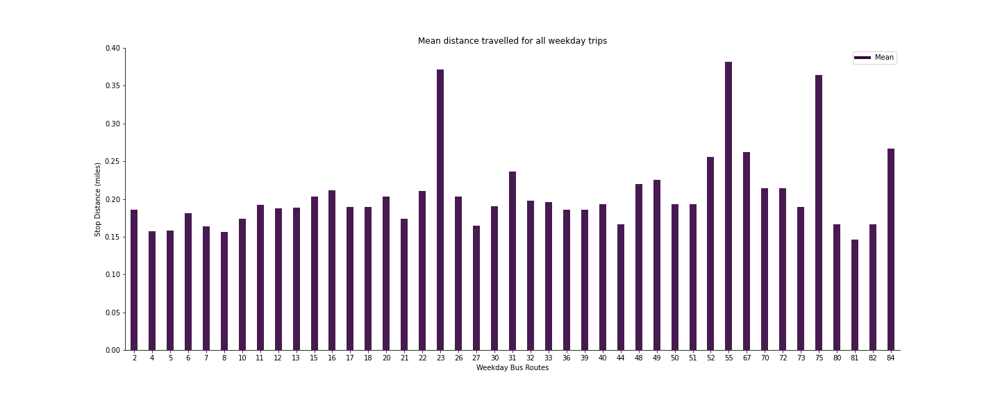
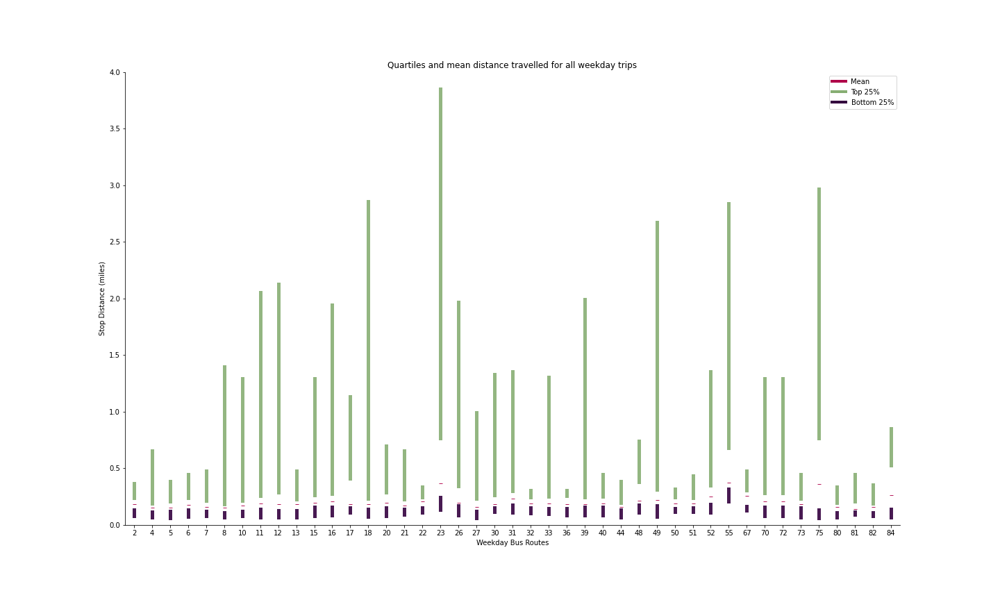
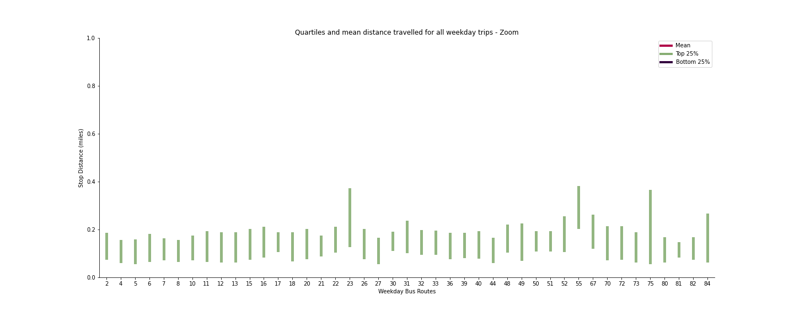
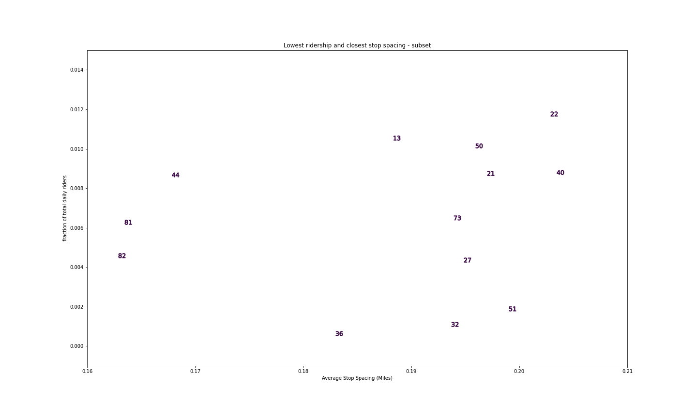
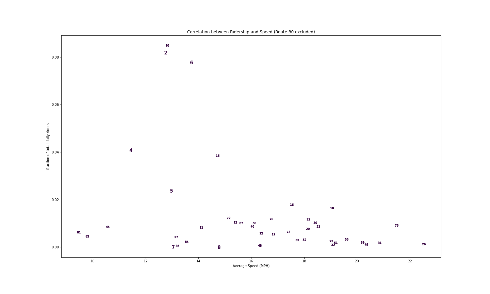

# Fall 2020 work on BRT - Report Summary

Author: Megan Tabbutt

### About:
 Listed below are some of the interesting plots and finds from work during the 2020 semester with CaSP and more groups. 
 
 
## Route Spacing - Route Balancing Considerations
 
## Initial tinkering with spacing: 

Process: Look at all weekday routes possible: "92_WKDX' where X are different perameters specified by Madison Metro. For every route, look at every possible trip during the week. For each trip find all of the distances between stops. Create one, massive, array with all of these distances. Then plot the mean, and quartiles as seen below.

### Mean of all Weekday Trips:

### Mean, Farthest 25%, Shortest 25% of all Weekday Trips:

### Mean, Farthest 25%, Shortest 25% of all Weekday Trips - ZOOM:

## Finding Routes to Rebalance:

Wanted to look at correlation between average speed the bus goes, average ridership for that route and average stop spacing. No correlation seems to exist. 

### Ridership vs Spacing (no 80):

### Ridership vs Spacing - Zoom:

### Ridership vs speed (no 80):

