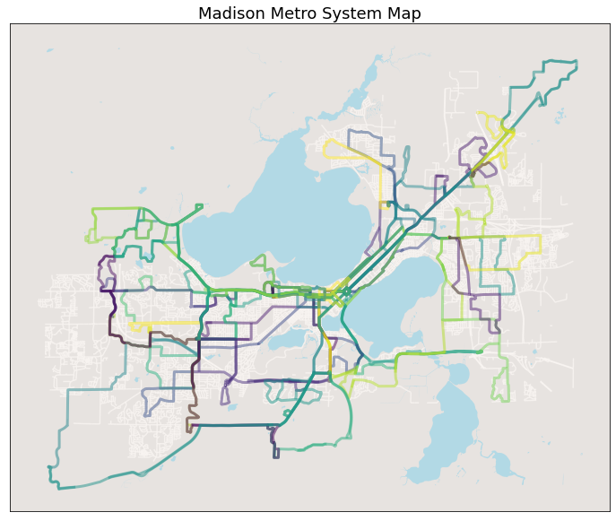
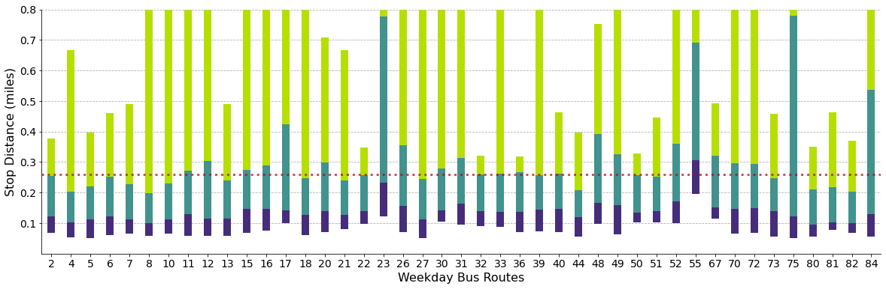
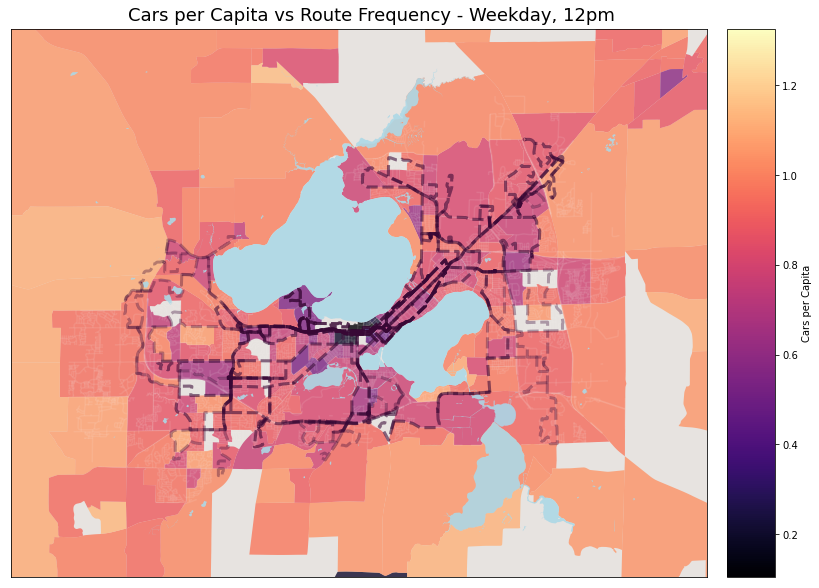

# Fall 2020 work on BRT - Report Summary

Author: Megan Tabbutt

## 1. Madison Metro Summary:

Figure 1: A plot showing all of the bus routes in the City of Madison. A greater opaqueness dipicts overlapping routes, and greater service for that area. 

 

## 2. Route Stop Spacing Summary:

Figure 2: Distribution of stop spacing by route. Three quartiles are shown: top 25%, middle 50%, bottom 25%. The overall system average is also show. Routes with a very high top 25% stop spacing most likely have a limited stop zone on the route. These limited stop zones increase route speed by having a section that does not stop at all, and typically cover larger distances across the city. 

 

## 3. Route Frequency:

Figure 3: A Summary of the frequency of service for bus routes during the weekday. 

 

## 4. Demographics vs Route Characteristics:

  
  

Figure 4: Heatmap of the cars per capita. Route frequency is denoted by opaqueness of the lines. More opaque and connected lines have more buses during the 6am hour. 

 
 
 
***

## Old Work: 

### About:
 Listed below are some of the interesting plots and finds from work during the 2020 semester with CaSP and more groups. 
 
 

## Route Spacing - Route Balancing Considerations

### Data is based on weekday regular routes (not weekend, not holiday)
 
## Initial tinkering with spacing: 

Process: Look at all weekday routes possible: "92_WKDX' where X are different perameters specified by Madison Metro. For every route, look at every possible trip during the week. For each trip find all of the distances between stops. Create one, massive, array with all of these distances. Then plot the mean, and quartiles as seen below.

### Mean of all Weekday Trips:

### Mean, Farthest 25%, Shortest 25% of all Weekday Trips:

### Mean, Farthest 25%, Shortest 25% of all Weekday Trips - ZOOM:

## Finding Routes to Rebalance:

Wanted to look at correlation between average speed the bus goes, average ridership for that route and average stop spacing. No correlation seems to exist. 

### Ridership vs Spacing (no 80):

### Ridership vs Spacing - Zoom:

### Ridership vs speed (no 80):

## Four Routes I Suggest We Rebalance:

These are the four routes with the lowest riders but the shortest stop spacing. Exclding special routes: 80, 81, 82, 36. 

### Data explanation: 
- Average spacing for a specific route: Take all possible weekday trips and for each trip find the stop spacing, get an average for each trip, average those together for a route specific average spacing. 
- Average spacing across all routes: take the above average for each route and average it together. 

 

- Percent of daily riders for a specific route: Take all riders of the route at all stops and divide by the total riders across all routes (for weekday only). 
- Percent of daily riders across all routes: Average the above percentages together for all routes.

 

- Average speed for a specific route: For ever trip possible for a specific route, take the total distance travelled dividided by the total trip time. Average these trips together for each route. 
- Average speed across all routes: Average the above averages together for all routes.

 

> _Average Ridership Overall: 1.36%     Average Speed Overall: 16.19 MPH     Average Stop Spacing Overall: .26 Miles_
### Route 27:

> _Average Ridership Overall: 1.36%     Average Speed Overall: 16.19 MPH     Average Stop Spacing Overall: .26 Miles_
### Route 32:

> _Average Ridership Overall: 1.36%     Average Speed Overall: 16.19 MPH     Average Stop Spacing Overall: .26 Miles_
### Route 44:

> _Average Ridership Overall: 1.36%     Average Speed Overall: 16.19 MPH     Average Stop Spacing Overall: .26 Miles_
### Route 51:

